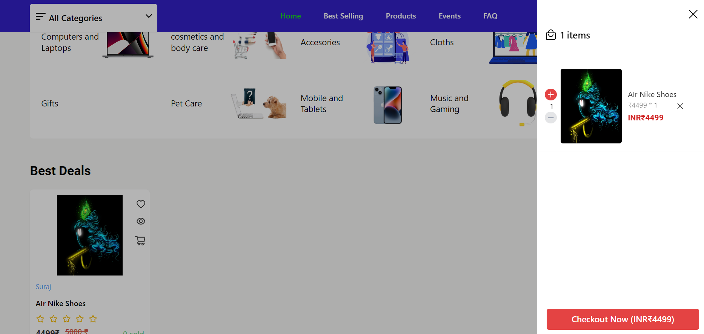
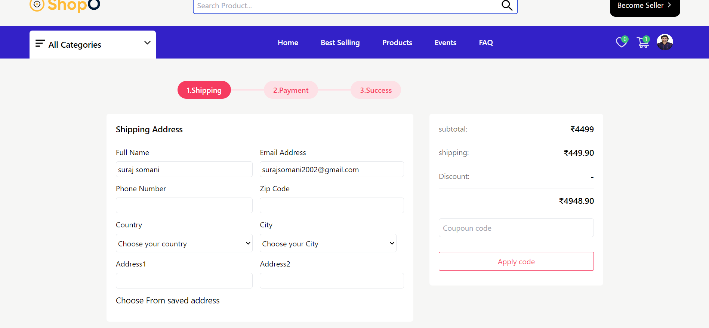
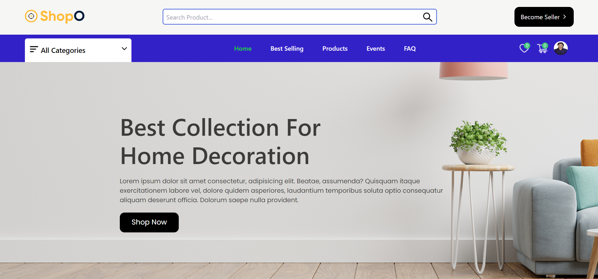
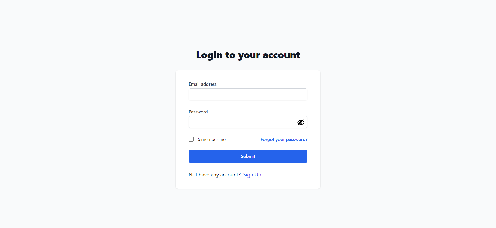
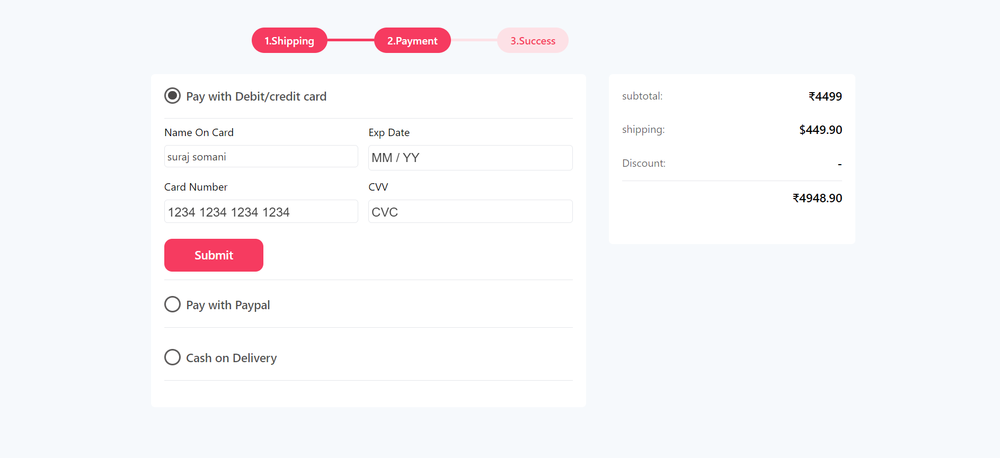
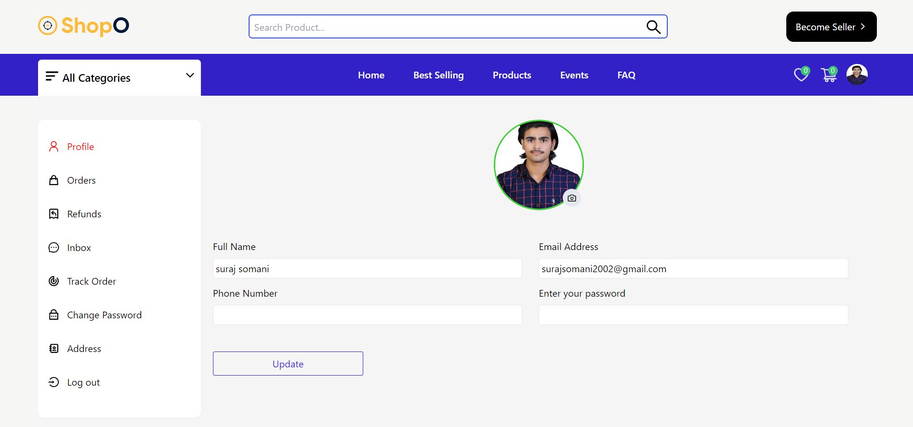
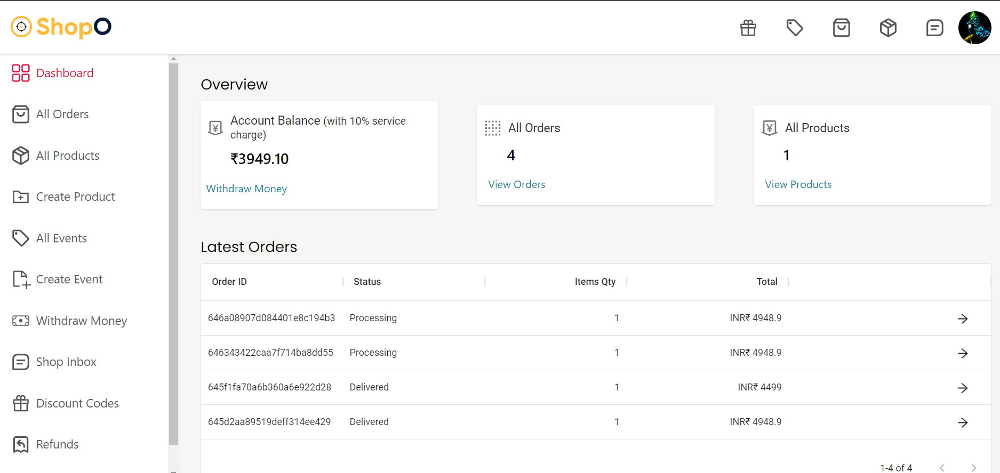
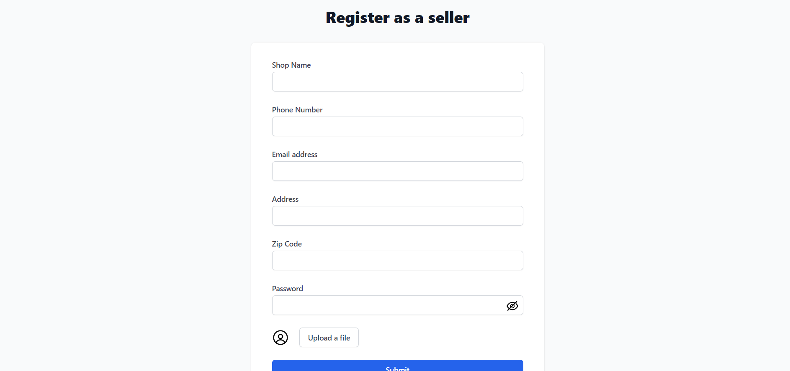

# multi vendor e-commerce website

API for coupon code generate which has been associated with the order and user ---> http://localhost:8000/api/v2/order/create-order
API to get the coupon code according to the user id ---> http://localhost:8000/api/v2/coupon/get-coupons/645d252c9519deff314ee3a0

## Screenshots

